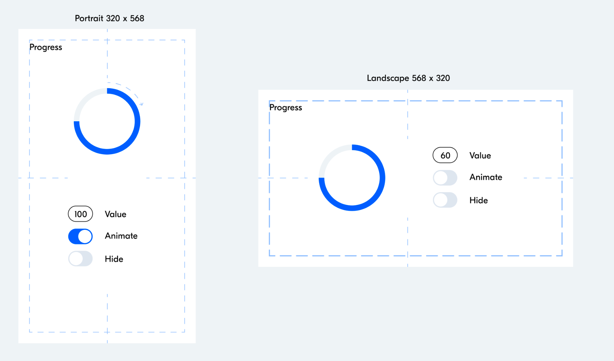
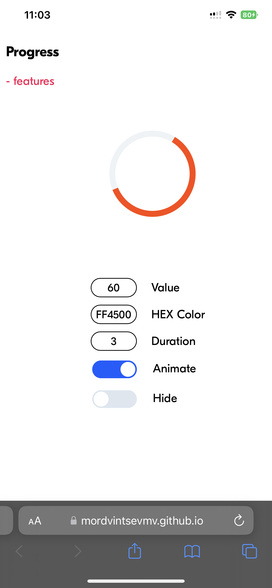
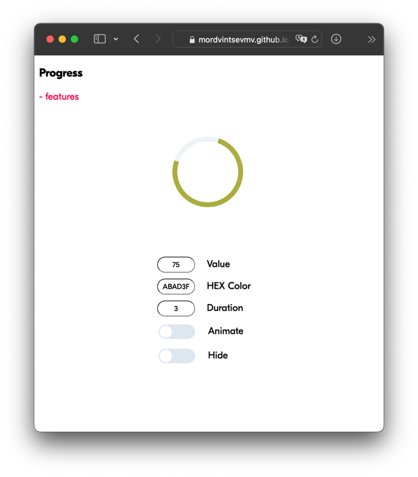
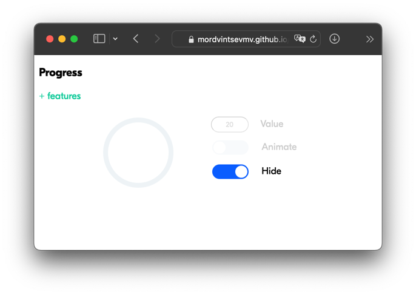

# Блок Progress
Тестовое задание для Ozon FinTech

<a href="https://mordvintsevmv.github.io/progressPage/" target="_blank">Проверить работу</a>

---

## <a name="content">Оглавление</a>

0. [Задание](#task)
1. [Макет](#layout)
2. [Реализация](#realization)
   1. [Класс progressRing](#realization_class)
   2. [Input](#realization_input)
3. [Пример работы](#test)
4. [Контакты](#contacts)

[🔝К оглавлению🔝](#content)

---

## <a name="task">Задание</a>

Разработать прототип блока Progress для использования в мобильных web-приложениях. Основное предназначение блока отображать процесс выполнения процессов и их прогресс выполнения.

__Особенности:__

• Блок должен иметь API для управления его состоянием.

• Блок должен быть спроектирован так, чтобы его было легко переиспользовать в
других приложениях.

__Состояния:__

      • Normal – базовое состояние, в котором путём задания Value можно управлять размером дуги, отражающей некоторый параметр или прогресс процесс. Начало дуги соответствует 12 часам, конец дуги при увеличении параметра Value движется по направлению часовой стрелки и достигает начала при значении 100.
      • Animated – независимое состояние, при котором блок или его элементы начинают вращаться с некоторым периодом по часовой стрелке.
      • Hidden – состояние скрывающее блок со страницы.

Результат выполнения задачи должен быть представлен в виде небольшого
приложения с элементами управления (Value – текстовый ввод числа от 0 до 100,
Animate и Hide – логические переключатели on / off, см. Макеты ).

Приложение должно быть адаптирующимся под ориентацию экрана – будет большим
плюсом.

Технологии:

      • JS (без jQuery и других библиотек / фреймворков, упрощающих и дополняющих функциональность окружения браузера).
      • CSS или любые другие пре/постпроцессоры.
      • HTML (без использования шаблонизаторов).

[🔝К оглавлению🔝](#content)

---

## <a name="layout">Макет</a>

[🔝К оглавлению🔝](#content)

---

## <a name="realization">Реализация</a>

По заданию блок должен быть спроектирован так, чтобы его было легко переиспользовать в других приложениях.

Для этого было решено разработать класс кольца прогресса и описать его основные методы. Такой подход позволяет:
1. Легко перенести код в другое приложение;
2. Создавать множество объектов одного класса, если требуется несколько колец прогресса;
3. Использовать уже готовые методы, которые полностью покрывают потребности;
4. Быстро добавлять новые методы для дополнительного функционала.

Для тестирования функционала была создана страница по макету с основными возможностями:
1. Изменить значение прогресса;
2. Включить/выключить анимацию;
3. Включить/выключить отображение кольца прогресса.

Также по собственной инициативе было решено добавить дополнительные возможности:
1. Изменение цвета кольца;
2. Изменение периода вращения кольца.

Основные элементы страницы были стилизованы в соответствии с макетом.

### <a name="realization_class">Класс progressRing</a>

Конструктор класса принимает id тега <circle> и получает объект со страницы. Такой подход позволяет создать объект для единственного кольца (в отличие от использования class в html).

Также в конструкторе заранее вычисляется радиус и длина окружности, которые используются в дальнейших расчётах.

Задается начальный прогресс, цвет шкалы и состояние кольца (по умолчанию normal: true).

В классе были описаны основные методы работы с кольцом прогресса:
1. Получение информации об основных параметрах объекта (print_...)
2. Изменение параметров кольца (set_...)
3. Изменение состояний кольца (animation_turnon, hide и т.д;)

В классе были выполнены проверки на корректность введенных данных, чтобы предотвратить ошибки пользователя.

### <a name="realization_input">Input</a>

Для тестирования работы созданного класса были созданы input на странице, а также js-скрипт для обработки их изменений.

1. percent_input - числовой input. Изменяет значение прогресса (%);
2. color_input - текстовый input. Изменяет цвет кольца (HEX);
3. duration_input - числовой input. Изменяет период вращения кольца (сек);
4. animation_button - checkbox. Включает/выключает анимацию вращения.
5. hide_button - checkbox. Включает/выключает отображение кольца прогресса.

[🔝К оглавлению🔝](#content)

---

## <a name="test">Пример работы</a>

### IOS Safari:

### MacOS Safari:

Также работа проверена на:
- iOS Chrome
- iOS Opera
- iOS Яндекс
- MacOS Chrome

[🔝К оглавлению🔝](#content)

---

## <a name="contacts">Контакты</a>

[🔝К оглавлению🔝](#content)

**TG**: @mordvintsevmv

**e-mail**: mordvintsevmv@gmail.com

[🔝К оглавлению🔝](#content)

